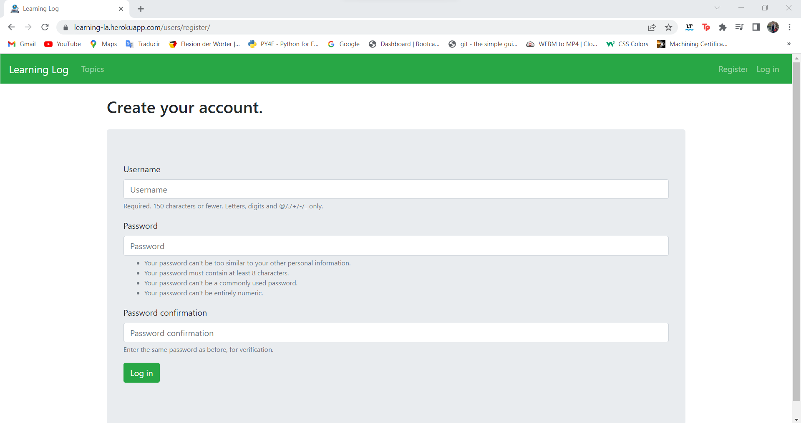

<h1 align="center">Django: Learning Log App</h1>

**About the Project:**

* Online journal app that helps you track data, information, and statistics about a particular topic.
This app, allows users to log the topics of their concerns, or interests and create journal inputs as they keep on learning and investigating about the topic. The Learning Log App home page will explain the site and invite the users/client, to either register or log in. Once logged in, the user can create new topics, add new inputs, edit existing files, and read created entries.

**Table of Contents:**

1. Tools
2. Walkthrough
3. Contact
4. Credits

## Tools

* `Language:` Python
* `Framework:` Django
* `Database:` SQLite
* `Deployment:` <a href="https://learning-la.herokuapp.com/
">Heroku</a>

## Walkthrough

**Home Page**

|  |
|:--:|
| *Figure 1. Home page of the Leaning Log App* |

**Register Page**

|  |
|:--:|
| *Figure 2. Register form for new users* |

**Topics Page**

|  |
|:--:|
| *Figure 3. Once the user logs in, he can take a look at his saved topics* |

**Enter Topics Page**

| |
|:--:|
| *Figure 4. Enter a topic default page, with a selected topic by the user* |

**Enter Entries Page**

| |
|:--:|
| *Figure 5. Enter an entry for the selected topic default page, with a selected entry by the user* |

**Final Views**

| |
|:--:|
| *Figure 6. Selected topic uploaded* |
| |
| *Figure 7. Selected entry uploaded* |

## Contact

* Name: Raul Maya Salazar
* Phone: +52 833 159 7006
* E-mail: raulmayas20@gmail.com
* GitHub: https://github.com/RaulMaya
* LinkedIn: https://www.linkedin.com/in/raul-maya/

## Credits
- <a href="https://www.amazon.com.mx/Python-Crash-Course-Eric-Matthes/dp/1593279280/ref=sr_1_1?crid=1NXA3FY0WI62R&keywords=python+crash+course&qid=1644954661&sprefix=python+crash%2Caps%2C608&sr=8-1
">Book: Python Crash Course: A Hands-On, Project-Based Introduction to Programming by Eric Matthes.</a>
